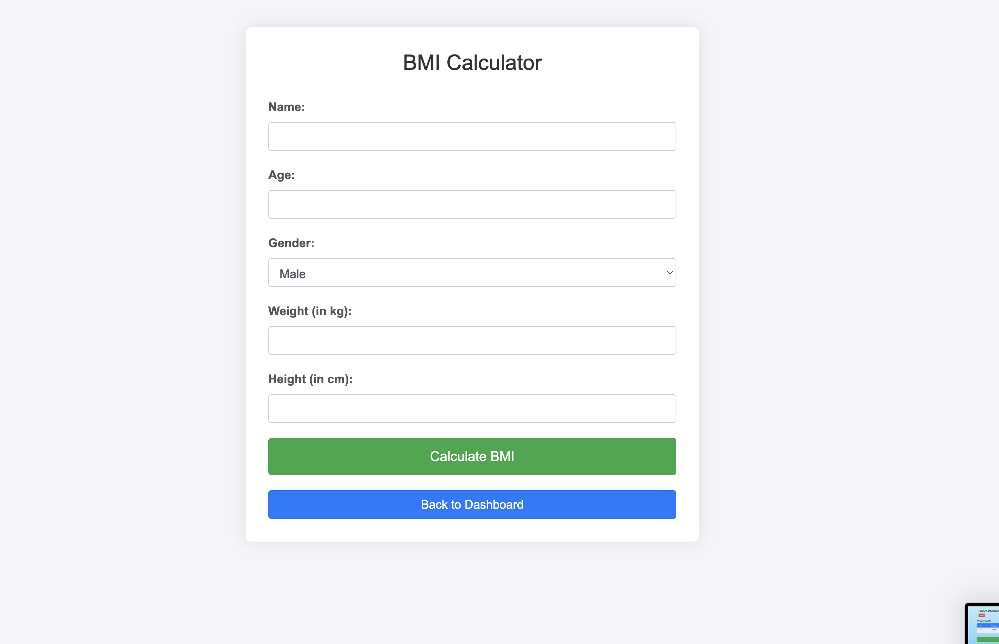

To include images in your README file, you can use Markdown syntax. Here's how you can update your README to include the pictures you mentioned:

```markdown
# BMI Calculator Application

## Overview

This BMI Calculator application allows users to calculate their Body Mass Index (BMI) by inputting their name, age, gender, height, and weight. The application stores user information and their BMI records in a MySQL database.

## Features

- User registration: Collects and stores user details including name, age, gender, height, and weight.
- BMI Calculation: Computes BMI based on the provided height and weight.
- Data Storage: Stores user details and BMI records in a MySQL database.

## Prerequisites

- PHP 7.4 or higher
- MySQL 5.7 or higher
- Web server (Apache, Nginx, etc.)

## Setup

1. **Clone the Repository**

   ```bash
   git clone https://github.com/yourusername/bmi-calculator.git
   cd bmi-calculator
   ```

2. **Configure Database**

   - Create a new MySQL database and user.
   - Import the provided SQL schema to create the necessary tables.

   ```sql
   CREATE TABLE BMIUsers (
     BMIUserID INT AUTO_INCREMENT PRIMARY KEY,
     Name VARCHAR(100),
     Age INT,
     Gender ENUM('Male', 'Female', 'Other'),
     CreatedAt TIMESTAMP DEFAULT CURRENT_TIMESTAMP
   );

   CREATE TABLE BMIRecords (
     RecordID INT AUTO_INCREMENT PRIMARY KEY,
     BMIUserID INT,
     Height FLOAT,
     Weight FLOAT,
     BMI FLOAT,
     RecordedAt TIMESTAMP DEFAULT CURRENT_TIMESTAMP,
     FOREIGN KEY (BMIUserID) REFERENCES BMIUsers(BMIUserID)
   );
   ```

   - Update the database configuration in your PHP files to connect to your MySQL server.

3. **Install Dependencies**

   If your project has any dependencies managed through Composer or another tool, install them:

   ```bash
   composer install
   ```

4. **Configure Web Server**

   - Ensure that your web server (Apache, Nginx, etc.) is configured to serve your application.
   - Place the project files in the appropriate directory (e.g., `/var/www/html` for Apache).

5. **Set File Permissions**

   Ensure that your web server has appropriate permissions to read and write files if needed:

   ```bash
   sudo chown -R www-data:www-data /path/to/your/project
   sudo chmod -R 755 /path/to/your/project
   ```

6. **Access the Application**

   Open your web browser and navigate to the application's URL, e.g., `http://localhost/bmi-calculator`.

7. **Troubleshooting**

   - If you encounter any issues, check the web server error logs for more information.
   - Ensure that your PHP configuration allows for the required file uploads and execution times.

## Usage

1. **Register a New User**

   - Navigate to the registration page.
   - Enter the required details: name, age, gender, height, and weight.
   - Submit the form to save the user details and calculate BMI.

2. **View BMI Records**

   - After registration, you can view your BMI records by navigating to the records page.

## Screenshots

### Registration Page


### Login Page


### Dashboard with BMI Calculator


### Database Schema


### BMI Calculation



## Contributing

Feel free to contribute to the project by submitting issues or pull requests.

## License

This project is licensed under the MIT License - see the [LICENSE](LICENSE) file for details.
```

### Key Points:
- Make sure the image paths (`DEMO_PIC/Registration_Page.png`, etc.) are correct relative to your README file's location.
- Ensure that the image files are included in your repository so that GitHub can render them properly.

Let me know if you need any more adjustments or additional help!
